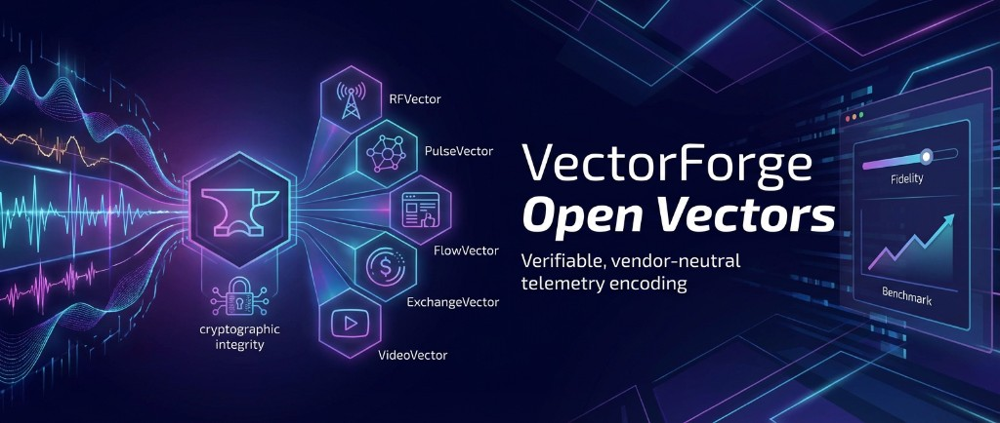

<p align="center">
  
</p>

# VectorForge Open Vectors

**VectorForge Open Vectors** defines how to encode raw telemetry into small, verifiable records with measurable fidelity and completeness, independent of any proprietary compression.

## What is this?

Open Vectors is a family of JSONL-based schemas for capturing high-volume, high-fidelity signals from multiple domains:

| Vector | Domain | Status | Version |
|--------|--------|--------|---------|
| **RFVector** | Radio frequency observations | Reference implementation available | v0.2.0 |
| **PulseVector** | Network activity (flows, events) | Reference implementation available | v0.2.0 |
| **FlowVector** | Content streams (web, social, firehose) | Reference implementation available | v0.2.0 |
| **ExchangeVector** | Financial/digital asset transactions | Reference implementation available | v0.2.0 |
| **VideoVector** | Video activity (segments, tracks, events) | Reference implementation available | v0.2.0 |

Each Vector provides:

- A **stable, vendor-neutral output format** for parsers and sensors
- A **cryptographic integrity layer** (DIVTs) for every record
- A **configurable fidelity model** that trades off fidelity vs. compute/bandwidth/storage
- A **benchmark methodology** to quantify context preservation

## Who is this for?

- **Sensor/parser vendors** building telemetry pipelines who want interoperable output
- **Platform engineers** ingesting multi-source telemetry who need a common format
- **Data engineers** validating record integrity and completeness
- **Analysts** who need to understand what fidelity guarantees their data carries

## Quick Start

1. **Understand the format**: Read [Getting Started](docs/getting-started.md)
2. **Review the spec**: See [spec/](spec/) for normative documents
3. **Validate your output**: Use the reference validators in [reference/](reference/)
4. **Measure fidelity**: Run the benchmark harness in [bench/](bench/)

## Repository Structure

```
├── spec/                  # Normative specification documents
├── schemas/               # JSON Schemas for validation
│   └── payloads/          # Vector-specific payload schemas
├── reference/             # Reference implementations (Python, Go)
├── bench/                 # Benchmark harness and datasets
├── test-vectors/          # Conformance test vectors
├── examples/              # Annotated example records
└── docs/                  # Documentation
    ├── concepts/          # Core concepts explained
    ├── vectors/           # Per-vector guides
    └── conformance/       # Conformance levels and testing
```

## Core Concepts

- **Vector Record**: A JSONL line containing a `record` (the payload) and a `divt` (integrity token)
- **DIVT**: Data Integrity Validation Token - cryptographic proof of record authenticity
- **Fidelity**: Measurable context preservation (not bitwise reconstruction)
- **Continuity**: Confidence that a record stream is complete for a time window

See [docs/concepts/](docs/concepts/) for detailed explanations.

## Conformance Levels

Implementations can claim conformance at four levels:

| Level | Name | What it proves |
|-------|------|----------------|
| A | Record Integrity | Envelope validates, DIVT validates, hash matches |
| B | Completeness | Continuity Level 2 manifests, CC/EF computed correctly |
| C | Payload + Profile | Payload validates against schema, valid profile reference |
| D | Benchmark | Runs harness, produces PF/CC/EF reports per contract |

See [docs/conformance/levels.md](docs/conformance/levels.md) for details.

## Version

Current specification version: **v0.2.0**

See [CHANGELOG.md](CHANGELOG.md) for version history.

## License

Apache 2.0. See [LICENSE](LICENSE).

## Contributing

See [CONTRIBUTING.md](CONTRIBUTING.md) for guidelines.
